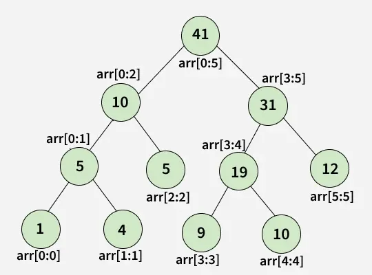

# Segment Tree

A segment tree is a data structure is which allows efficient querying and updating of intervals or segments of an array.

Its useful for

- Finding Sum, minimum, maximum or any other operation over a specific range of elements in an array.

Its built recursively by dividing the array into segments until each segment represents a single element.

It enables fast query in O(log n).



### Structure of the Tree

- At each level, we divide the array segments into two parts. If the given array

* At each level, we divide the array segments into two parts. If the given array had \***\*[0, . . ., N-1]\*\*** elements in it then the two parts of the array will be \***\*[0, . . ., N/2-1]\*\*** and \***\*[N/2, . . ., N-1]\*\*** .
* We will then recursively go on until the lower and upper bounds of the range become equal.
* The structure of the segment tree looks like a [binary tree](https://www.geeksforgeeks.org/dsa/binary-tree-data-structure/)

### Steps to create

1. Start from the leaves of the tree
2. Recursively build the parents from the merge operation.

Building the tree takes O(n) time.

### Code

```java
void buildSegTree(vector<int>& arr, int treeIndex, int lo, int hi) {
    if (lo == hi) {                 // leaf node. store value in node.
        tree[treeIndex] = arr[lo];
        return;
    }

    int mid = lo + (hi - lo) / 2;   // recurse deeper for children.
    buildSegTree(arr, 2 * treeIndex + 1, lo, mid);
    buildSegTree(arr, 2 * treeIndex + 2, mid + 1, hi);

    // merge build results
    tree[treeIndex] = merge(tree[2 * treeIndex + 1], tree[2 * treeIndex + 2]);
}
```
