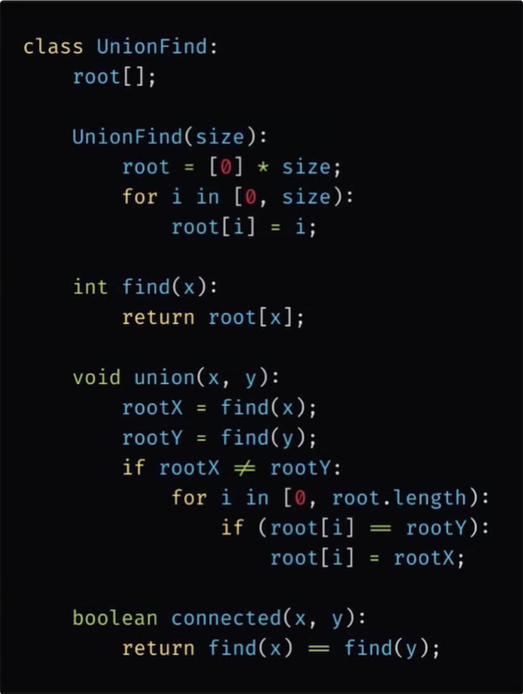

# Disjoint Set

References: [Google](https://www.google.com/search?q=what+is+a+disjoint+set+in+cs&sca_esv=bd8b7c99eeaeb415&sxsrf=AE3TifNxtBb74tuUfOa3fd4pB8waOEMTyQ%3A1753534981695&ei=BdKEaKWcKo-JqfkP_oj4wAk&ved=0ahUKEwjlsr3tytqOAxWPRCoJHX4EHpgQ4dUDCBA&uact=5&oq=what+is+a+disjoint+set+in+cs&gs_lp=Egxnd3Mtd2l6LXNlcnAiHHdoYXQgaXMgYSBkaXNqb2ludCBzZXQgaW4gY3MyBRAAGIAEMgYQABgWGB4yBhAAGBYYHjIGEAAYFhgeMgYQABgWGB4yBhAAGBYYHjIGEAAYFhgeMgYQABgWGB4yBhAAGBYYHjIGEAAYFhgeSKYKUJgEWNIJcAJ4AZABAJgBmQKgAZYHqgEFMC4xLjO4AQPIAQD4AQGYAgagAqcHwgIKEAAYsAMY1gQYR8ICDRAAGIAEGLADGEMYigWYAwCIBgGQBgqSBwUyLjEuM6AH1BqyBwUwLjEuM7gHogfCBwUwLjUuMcgHDg&sclient=gws-wiz-serphttps:/) , [Leetcode](https://leetcode.com/explore/learn/card/graph/618/disjoint-set/3881/https:/)

## What is a Disjoint Set?

A disjoint set is a data structure (Also known as as the union find data structure), that is used to store a collection of sets where each element belongs to exactly one set, and not two sets overlap.

## What are the 3 main operations

1. makeSet(x): Makes a new set with one element x.
2. find(x): Returns the representative (root) of the set that contains x
3. union(x,y): Merges the sets that contain x and y into a single set

## How do disjoint sets work?

#### 1. Initialization: Make Set(x)

- For every element x, create a set where x is its own parent.
- Think of the dictionary like: { x: x } for each.
- Each Element points to itself initially, forming n seperate singleton sets.

#### 2. Find with Path Compression: find(x)

- Recursively follow parent pointers until you reach the root (i.e. parent[x] == x).
- Then, Update all nodes along the path to directly point to the root
- This flattens the structure, making subsequent find calls faster.

```
def find(x):
     if parent[x] != x:
          parent[x] = find(parent[x])
     return parent[x]

```

#### 3. Union by Rank: union(x, y)

- Combines the sets that contain x and y
- To keep the tree shallow, we always attach the smaller tree to the larger one.

How it works

- Get the roots of both sets (find(x))
- Compare their ranks (approx. height of the tree)

  - Attach the smaller tree under the larger one.
  - If equal, pick one and increment its rank.

```
def union(x, y):
    rootX = find(x)
    rootY = find(y)

    if rootX == rootY:
        return  # already in the same set

    if rank[rootX] < rank[rootY]:
        parent[rootX] = rootY
    elif rank[rootX] > rank[rootY]:
        parent[rootY] = rootX
    else:
        parent[rootY] = rootX
        rank[rootX] += 1

```

## Terminologies

- Parent Node: The direct parent of a vertex
- Root Node: A node without a parent node. It can be viewed as a parent node of itself.

# Quick Find

- When we want to find the parent of a node, we keep going up until we get to the parent. Step-by-step
- We store the group id in the array of each set of integers. Find(x) returns the group ID of that node.
- Lets say we have a tree, if i have the bottom node, we want to point to the ultimate parent.

  - Union function needs to traverse the entire array, setting each parent for those nodes to be the root node.
- Find will NOT be returning the ultimate parent of each node in a disjoint set.
- When we do union with a new value

  - Lets say value A has a parent of its root node, and value B points to a different value.
  - We perform finds to get the parents of each, and then if they arent the same, we go through each node in the array until we either find a value that is the same root.




|                 | Union-Find Constructor | Find | Union | Connected |
| ----------------- | ------------------------ | ------ | :------ | ----------- |
| Time Complexity | O(N)                   | O(1) | O(N)  | O(1)      |

- Union-Find is us initialising an array with the same length as the number of nodes in the graph
- Find is getting the immediate parent of the node we are unioning with
- Union is O(n) as we need to traverse through the entire array and update the root vertices of the set that is going to be merged into another set.
- Connected takes O(1) time since it involves the two find calls and the equality check operation.

# Quick Union (Different from Quick Find)

- Quick find has a much faster find operation O(1), because we are just returning the group id and changing on union, but that makes our union operations slower as you can see. Quick Union aims to improve that.
- For each union, each root node we get to, we set the parent to the root node.
- For each connection (x,y), we get the parent of x and set it to the root, and same for y.

  
- So for this code above

  - We initialise the array in the UnionFind method, setting each value to itself.
  - For find(x), whilst the value doenst equal its parent, keep going up.
  - Then if we want to union, we find the roots of each x and y, and if they arent connectsed already (which we would know if they have the same root node), then we join them.


|                 | Union-find Constructor | Find | Union | Connected |
| ----------------- | ------------------------ | ------ | ------- | ----------- |
| Time Complexity | O(N)                   | O(N) | O(N)  | O(N)      |

***** `find` operation, in the worst-case scenario, we need to traverse every vertex to find the root for the input vertex. The maximum number of operations to get the root vertex would be no more than the tree's height, so it will take O(N) time.

* `union` operation consists of two `find` operations which (**only in the worst-case** ) will take O(N)**O****(****N****)** time, and two constant time operations, including the equality check and updating the array value at a given index. Therefore, the `union` operation also costs O(N) in the worst-case.
* The `connected` operation also takes O(N)**O****(****N****)** time in the worst-case since it involves two `find` calls.

# Why is Quick Union more Efficient than Quick Find?

1. Union Operation is Localised
   * Union only touches a few elements (the roots)
   * In Quick Find, unions requires scanning and potentially updating all N elements
2. Scales Better with Large Data
3. Easy to optimize further
   * Path Compression: During find, flatten the tree
   * Union by Rank/ Size: Always attach the bigger one.

# Union By Rank

* Ordering by a specific criteria. Previously for the union we always chose th root node of x and set it as the new root node for the other vertex. By choosing the parent node based on a certain criteria, we can limit the maximum height of each vertex.
  * The rank refers to the height of each vertex
* Instead of choosing always x's parents, we instead choose the vertex with the larger "Rank", merging the shorter tree under the taller tree and assign the root node of the taller tree as the root node for both vertices.
