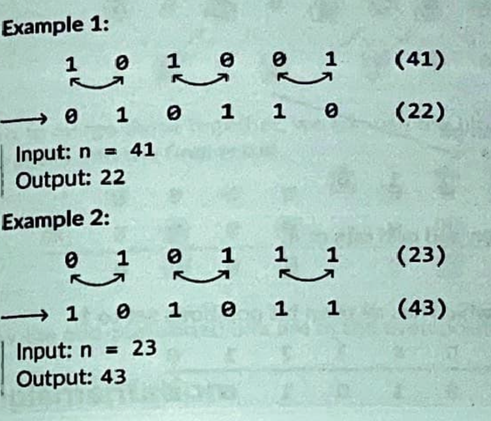

# Swap Odd and Even Bits

Given an unsigned 32-bit integer n, return an integer where all of n's even bits are swapped with their adjacent odd bits.

Example 1




### Intuition

The first thing you notice is that
- every bit in the even positions need to be shifted one position to the left, 
- every bit in the odd positions need to be shifted one position to the right. 

This suggests that if we had a way to extract all the even and odd-positioned bits separately, we could shift them accordingly and then merge them back together, so the odd-positioned bits are in the even positions and vice versa. 


So how do we get all the even bits? 
- Use a bit mask that has every even bit set to 1
- Perform a bitwise AND with this mask and n gives us an integer where all the bits at odd positions are set to zero, ensuring only the bits in even positions remain.

Now do the same for the odds. 

This means we have all the even and odd bits separately, where we can use them to obtain the results, where the bits at odd and even positions are swapped. 

Lastly, we perform a left shift on the even positions once, and a right shift on the odd positions once. Then we perform an OR on them both to get the last positions. 

### Code

```python
    def swap_odd_and_even_bits(n: int) -> int: 
        even_mask = 0x5555555
        odd_mask = 0xAAAAAAA

        even_bits = n & even_mask
        odd_bits = n & odd_mask

        return (even_bits << 1) | (odd_bits >> 1)
```

### Complexity
TC: O(1)
SC: O(1)