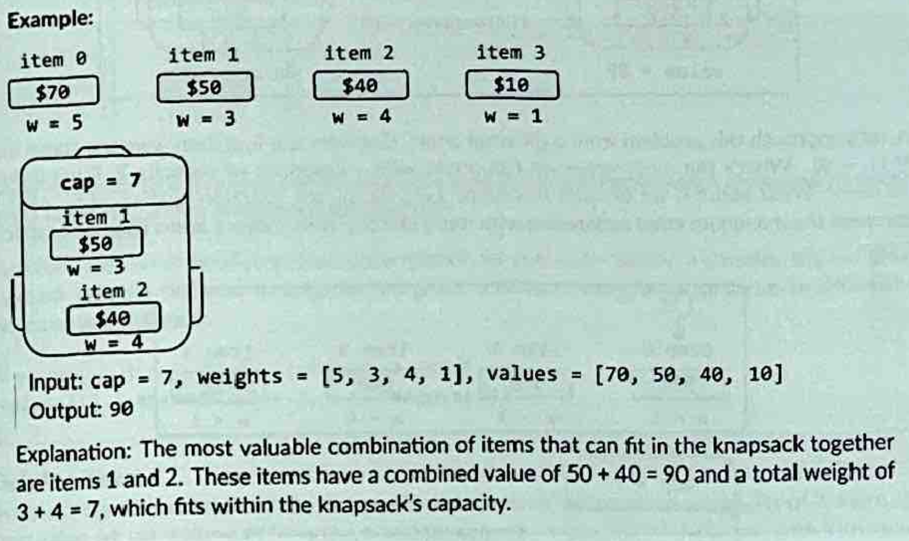

# 0/1 Knapsack

You are a thief planning to rob a store. However, you can only carry a knapsack with a maximum capacity of cap units. Each item (i) in the store has a weight (weights[i]) and a value (values[i]).

Find the Maximum total value of the items you can carry in your knapsack.



### Why is it called 0/1 Knapsack ?

Its called 0/1 Knapsack because were given a binary decision for each. We either include it in the knapsack, or exclude it.

### Why wouldnt we use greedy? 

Because greedy doesnt always provide the correct value.

### Intuition

For each item, we explore two simple paths: either we include it or we don't.

1. Don't Include the Item: The maximum value is simply the value we could achieve using the previous set of items and the same capacity.
2. Include the Item: This is only possible if the item's weight is less than or equal to the current capacity $w$. If we include it, the maximum value is the item's value plus the maximum value we could achieve with the remaining capacity ($w$ minus the item's weight) using the previous set of items (found by looking up the corresponding cell in the table).

### Step By Step

1. Initialise the table. You need a N (number of Items) by W (maximum weight capacity of the knapsack) table. The first row and column should be initialised to zero, as thats our base case. 
2. Fill the Table Iteratively. You go in a normal traversal, and make the decision
    1. IF the weight of the item is GREATER than the current capacity, then you cannot include that item, and you grab the vertically previous value in the array. DP[i][w] = DP[i-1][w]
    2. If the item is less than or equal to the current capacity (w),  then you must choose the maximum of two options
        1. Exclude item, and use the previous value (DP[i][w] = DP[i-1][w])
        2. Include Item: The value v plus the maximum value achievable with the remaining capacity (w - wi) using the previous set of items, which is found at DP[i-1][w - wi] 
            1. DP[i][w] = max(DP[i - 1][w], vi + DP[i-1][w - wi] (the previous max of the remaining space).
3. Once filled, the maximum value is at the bottom right corner of the table. 

### Complexity

TC: O(n * m)

SC: O(n * m) 

### Code 

```python
def knapsack_tabulation():
    n = len(values)
    tab = [[0]*(capacity + 1) for y in range(n + 1)]

    for i in range(1, n+1):
        for w in range(1, capacity+1):
            if weights[i-1] <= w:
                include_item = values[i-1] + tab[i-1][w-weights[i-1]]
                exclude_item = tab[i-1][w]
                tab[i][w] = max(include_item, exclude_item)
            else:
                tab[i][w] = tab[i-1][w]

    for row in tab:
    	  print(row)

    return tab[n][capacity]

values = [300, 200, 400, 500]
weights = [2, 1, 5, 3]
capacity = 10

print("\nMaximum value in Knapsack =", knapsack_tabulation())
```

