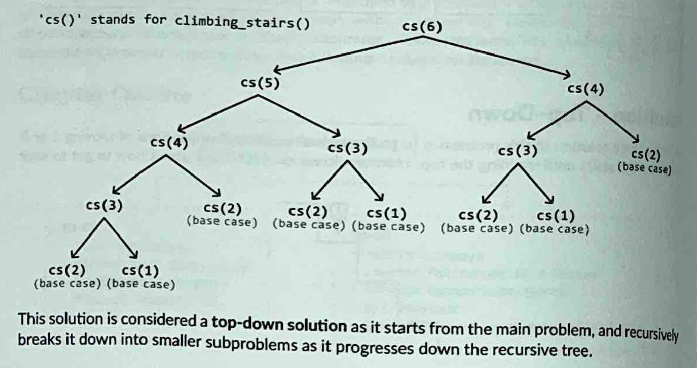

# Climbing Stairs Pattern

### Problem Statement

Determine the number of distinct ways to climb a staircase of n steps by taking either 1 or 2 steps at a time.

---

### Whats the intuition behind it?

In order to know the distinct ways to climb a staircase of n, since we are taking 1 or 2 steps at a time, we know we need to know how many unique ways there are for n - 1 and n - 2 stairs. This gives us the possible ways for n stairs.

This highlights the **Optimal Substructure** : Where in order to solve the unique ways to n, we need answers to 2 of its subproblems. We can translate this into a **Recurrence Relation: climbing_stairs(n) = climbing_stairs(n - 1) + climbing_stairs(n - 2).**



### How does Memoization come into it?

Memoization is where you store the values of the subproblems youve calculated in order to save compute and avoid rerunning the calculations unecessarily, due to the problems overlapping. For this problem, we can use a 1D Array or HashMap (rec.) to store the values we have.

This means for each, we push the number of unique ways for that index, so that the next call can easily reference it.

**So what about optimization?**

For bottom up we can do an optimization where we only store the last 2 values of the staircase, rather than all values. This is because at any staircase we get to, we only need to know the last 2 values.

This doesnt work for Top down, because of the recursive calls we make. Whichever call happens first (n-1) or (n-2) will do most of the work. Since we dont want our second call to do it all again, we store the answers to the problem and check if in case the memo'd store has it first. Its going down the tree so we need all values, rather than just the last 2.

---

### Implementation - Bottom Up

```
def climbing_stairs_bottom_up(n : int) -> int:
    if n <= 2:
        return n
    dp = [0] * (n + 1)

    # Base cases .
    dp [1L dp[2] = 1, 2

    # Starting from step J, calculate the number of ways to reach each
    # step until the n-th step
    for i in range(3, n + 1):
        dp(i] = dp[i - 1] + dp[i - 2]
    return dp[n]
```

#### Implementation - Top Down

```
def climbing_stairs_bottom_up_optimized(n: int) -> int:
    if n <= 2:
        return n

    # Set 'one_step_before' and 'two_steps_before' as the base cases.
    one_step_before, two_steps_before = 2, 1

    # The original code used '{}' for range, which is incorrect.
    # It has been corrected to '()'.
    for i in range(3, n + 1):
        # Calculate the number of ways to reach the current step.
        current = one_step_before + two_steps_before

        # Update the values for the next iteration.
        two_steps_before = one_step_before
        one_step_before = current

    return one_step_before
```

---

### Complexity

**Top Down**

Time Complexity

- Without memoization, the time complexity of climbing_stairs_top_down is 0(2^n) because the depth of the recursion tree is n, and its branching factor is 2 since we make 2 recursive calls at each point in the tree.
- With memoization, we ensure each subproblem is solved only once. Since there are n possible subproblems (one for each step from step 1 to step n), the time complexity is O(n).

Space Complexity: The space complexity is O(n) due to the recursive call stack, which grows to a height of n. The memoization array also contributes to the space occupied by storing n key-value pairs.

**Bottom Up**

Time Complexity: The time complexity of climbing_stairs_bottom_up is O(n) as we iterate through n elements of the DP array.

Space Complexity: The space complexity is O(n) due to the space taken up by the DP array, which contains n + 1 elements.
