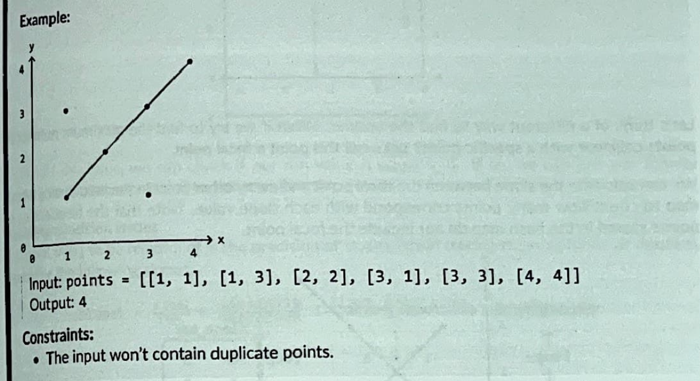
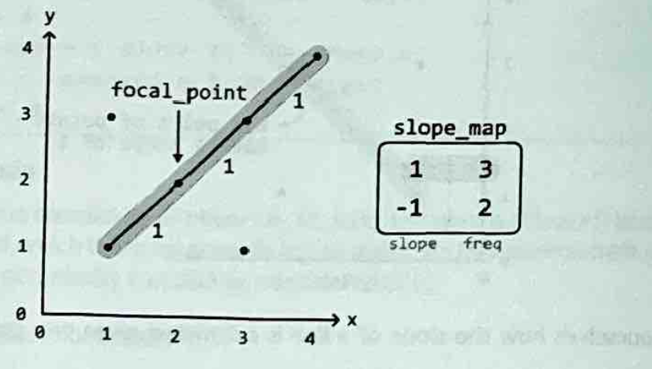

# Maximum Collinear Points

Given a set of points in a 2 dimensional plane, determine the maximum number of points that lie along the same straight line.

Collinear: (of points) lying in the same straight line.

### Inuition

In order to find out the values that are on the same line, we need to remember how to get the slope of a line.

slope = rise / run = yb - ya / xb - xa

Which will give us the slope of an input. The problem is that the slops can be the same but may not be collinear.

So since we need to know the number of points collinear to a certain point, we can set an anchor called the focal_point. This allows us to find the maximum number of points collinear with this focal point.

