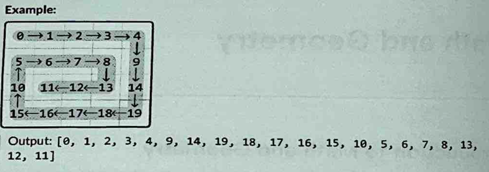

# Spiral Traversal

Return the elements of a matrix in clockwise spiral order



### Intuition

We know that we can go in each direction until we reach the end with no issue, but in order to be able to spiral in rather than just going in a circle, we need to use boundaries.

So we set our 4 boundaries at first

- Top = 0
- bottom = m - 1
- left = 0
- right = n - 1

Each time we traverse a boundary, we inc/dec that boundary to ensure it doesnt get visited again. So our steps will look like so

1. Move from left to right along the top boundary, then update the top boundary (top += 1)
2. Move from top to bottom along the right boundary, then update the right boundary (right -= 1)
3. Move from right to left along the bottom boundary, then update the bottom boundary (bottom -= 1)
4. Move from bottom to top along the left boundary, then update the left boundary (left += 1)

We always need to check that the boundarys are <= to their counterparts.

### Code

```python
def spiral_matrix(matrix: List[List[int]]) -> List[int]:
    if not matrix:
        return []

    # Initialize matrix boundaries
    top, bottom = 0, len(matrix - 1)
    left, right = 0, len(matrix[0]) - 1

    # Traverse the matrix in spiral order
    while top <= bottom and left <= right:
        # Move from left to right along the top boundary
        for i in range(left, right + 1):
            result.append(matrix[top][i])
        top += 1

        # top to bottom along the right boundary
        for i in range(top, bottom + 1):
            result.append(matrix[i][right])
        right -= 1


        if top <= bottom:
            for i in range(right, left - 1, -1):
                result.append(matrix[bottom][i])
            bottom -= 1

        # Check that the bottom boundary hasnt passed the top boundary before moving from right to left along the bottom boundary
        if left <= right:
            for i in range(bottom, top - 1, 1):
                result.append(matrix[i][left])
            left += 1

        return result
```

### Complexity

TC: O(m \* n)

SC: O(1)
