#### Types

- short: int is assumed for this type
- long: int is assumed for this type. Can just refer to as "long" without specifying int
- long long is also int assumed
- Integer data types (for unsigned data)
  - unsigned char
  - unsigned short int
  - unsigned int
  - unsigned long int
  - unsigned long long int

- "long long": a signed integer type that holds a 64 bit integer.
  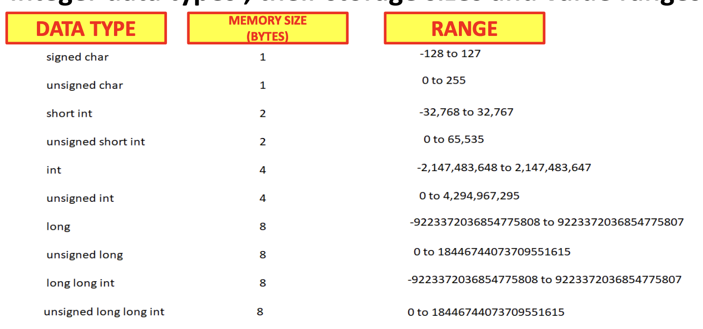
- C standard does not fix the storage sizes of different data types. It only talks min and max values
- Some compilers fix 32 bits storage size for long type variables and some compilers fix 64 bits.
- Data types of fixed size irrespective of compilers
  - Short (signed or unsigned) is 2 bytes
  - char (signed or unsigned) is 1 byte
  - long long (signed or unsigned) is always 8 bytes

- Char (Integer Data Type)
  - 1 Byte of memory, represents single ASCII value, no other special meaning.
  - char Range: -128 to 127
  - unsigned char range: 0 to 255
  - unsigned char cityXTemperature; /_ This is a variable definition _/
  - cityXTemperature = 25; /_ This is variable initialization _/

- Short int & unsigned short in: 2 Bytes of signed data
  - Can just call short (for signed) or unsigned short, int assumed.
  - Size of an int is decided by the complier of the target hardware.

- long or unsigned long: 4 or 8 bytes of memory
  - Decided by target hardware

- sizeof operator
  - used to find out the size of a variable.
  - The output of the sizeof operator may be different on different machines because it is compiler dependent.

#### Format Specifiers

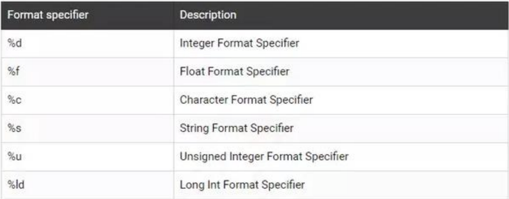

#### Byte Signed Data Representation

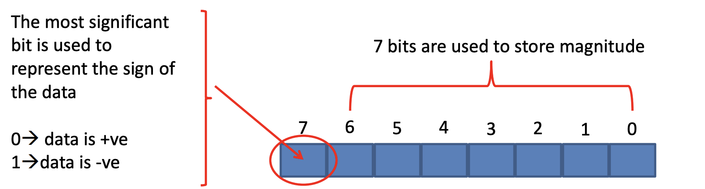

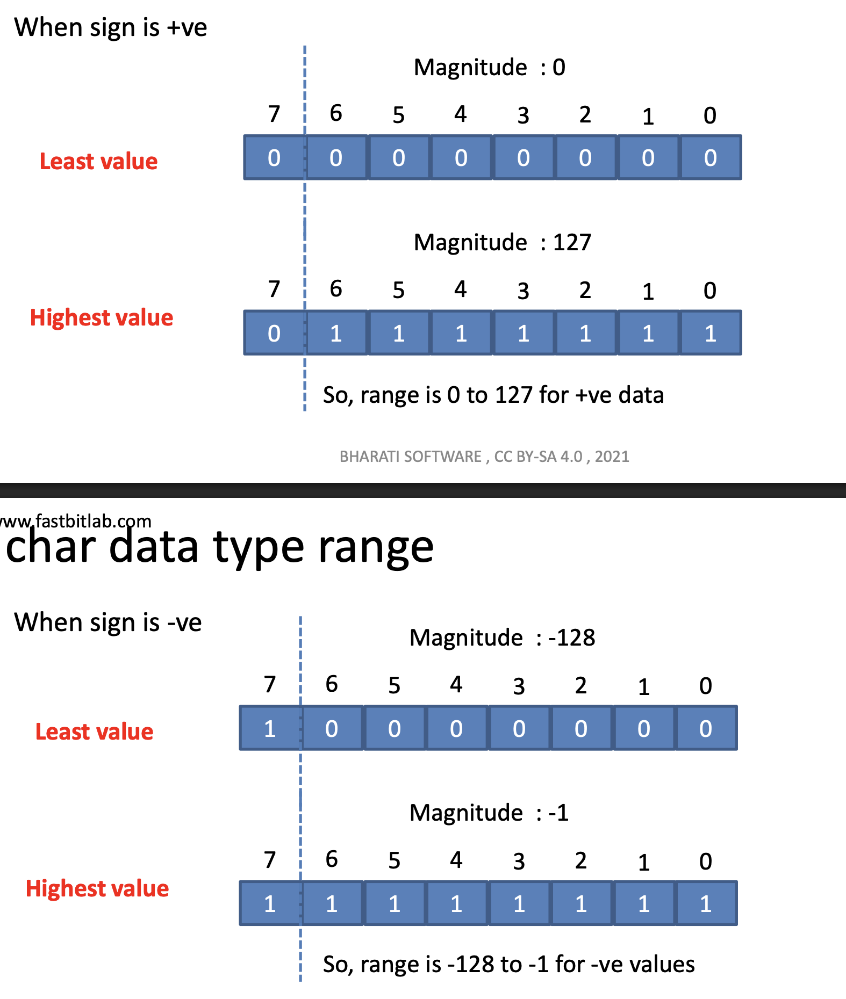

#### How to Calculate 2's Complement

To find the 2's complement representation of a negative number (n bits): 1 3 2 4 1. Write the positive binary value (with leading zeros to fill n bits) 2. Invert all bits (change 0→1, 1→0) — this is 1's complement 3. Add 1 to the result (ignore overflow beyond n bits)
Example: -5 in 4 bits
• +5 = 0101
• Invert: 1010
• Add 1: 1011 (-5)1 2

#### Variables

- Identifiers for data
- Acts as a label to a memory location where the data is stored
- Variable names are not stored inside the computer memory, and the compiler replaces them with memory location addresses during data manipulation
- Cant have variable names more than 30 letters
- Only digits,chars and underscore
- A variable is defined when the compiler generates instructions to allocate the storage for the variable.
- A variable is declared when the compiler is informed that a variable exists along with its type. The compiler does not generate instructions to allocate the storage for the variable at that point.
  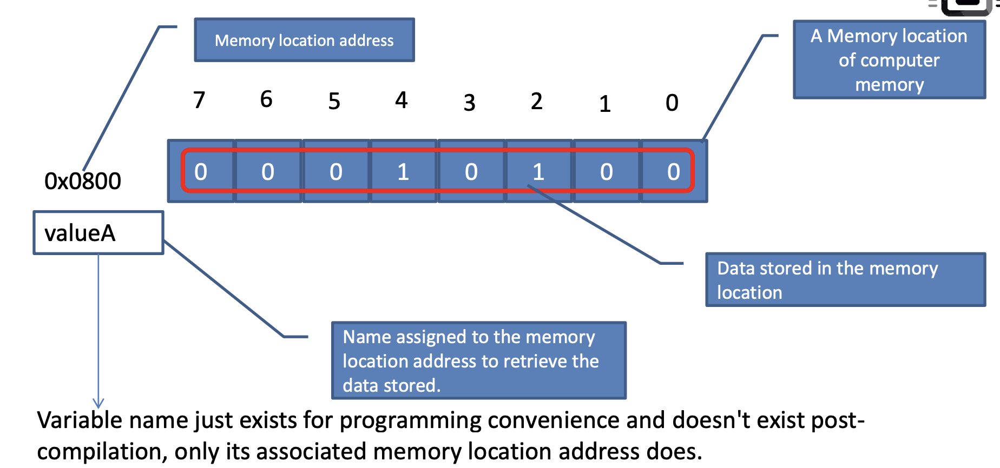

#### Storage Classes in C

- Decides the scope of a variable, visibility of a variable and lifetime of a variable.
- 2 Widely used storage classes in C
  1. static
  2. extern
- The **static keyword** in C has different meanings depending on context: it preserves variable values across function calls when applied to local variables, and it restricts visibility to the current file when applied to global variables or functions.
- When you declare a variable as `static` inside a function, it **retains its value between function calls** rather than being reinitialized each time. The variable is initialized only once and persists for the entire program execution.

| Aspect           | Local Variable                        | Static Variable                     |
| ---------------- | ------------------------------------- | ----------------------------------- |
| Lifetime         | Exists only during function execution | Exists throughout program execution |
| Reinitialization | Reinitialized each function call      | Initialized only once               |
| Storage          | Stored in the stack                   | Stored in the data segment          |

- Extern
  - 'extern' storage class specifier is used to access the global variable , which is defined outside the scope of a file.
  - 'extern' storage class specifier can also be used during the function call, when the function is defined outside the scope of the file.
  - The keyword ‘extern’ is relevant only when your project consists of multiple files, and you need to access a variable defined in one file from another file.

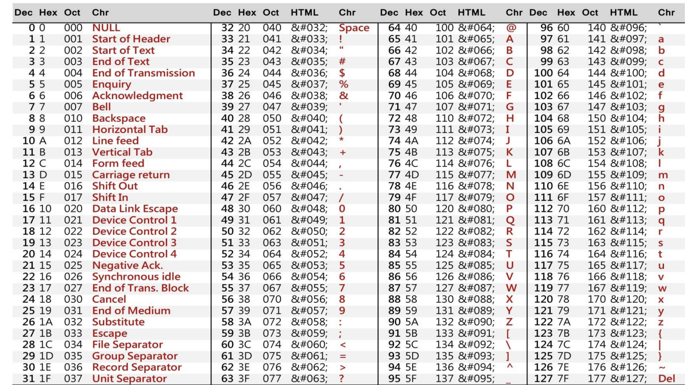

#### Variable Address

- Using the & prefix gives the memory location address of the variable
  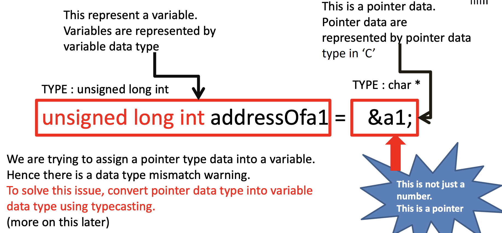
  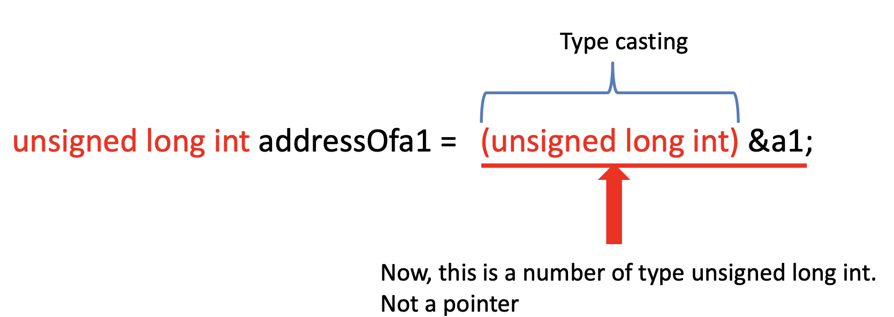

#### scanf

- scanf is a standard library function that allows you to read input from standard in.
- Standard in for us is generally the keyboard
- By using scanf library function you can read both characters and numbers from the keyboard.
- Example Usage: scanf("%d", &age) where &age is the reference, putting the read value into the address of age. %d is the integer formatter
  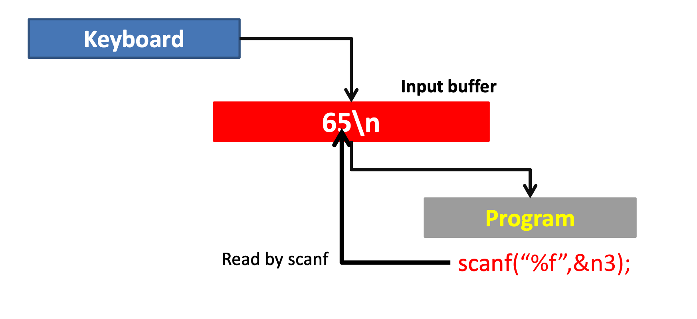

#### getchar()

- returns the ascii format of a character inputted into the keyboard, and the program hangs on getChar until a char is inputted

### Functions

- In 'C' a function is nothing but a collection of statements to perform a specific task.
- Functions provide abstractons
- main when there are command line arguments:
  `int main(int argc, char* argv[])`
  - main only takes 0 or 2 arguemnts
  - main() is the special function in C from where execution of a program starts and ends.
- In C, functions first have to be declared (prototype) before they can be used
  - Prototype lets the compiler know about the return data type, argument list and their data type and order of arguments being passed to the function.

#### TypeCasting

- Typecasting is a way of converting a variable or data from one data type to another data type.
- Data will be truncated when the higher data type is converted in to lower
- 2 Types of casting
  - Implicit Casting (Compiler does this)
  - Explicit Casting (Programmer does this)

### Pointers

- Pointers are a memory adress, and on a 64 bit machine, the pointer size is 8 bytes.
- pointers are denoted with a \* after the data type declaration.
  - e.g. char* address1 = (char*) 0x0007FFF8E3C3824;

- The compiler will always reserve 8 bytes for the pointer variable irrespective of their pointer data type. In other words, the pointer data type doesn’t control the memory size of the pointer variable.
- The pointer data type decides the behaviour of the operations carried out on the pointer variable. Operations: read, write, increment, decrement.
- 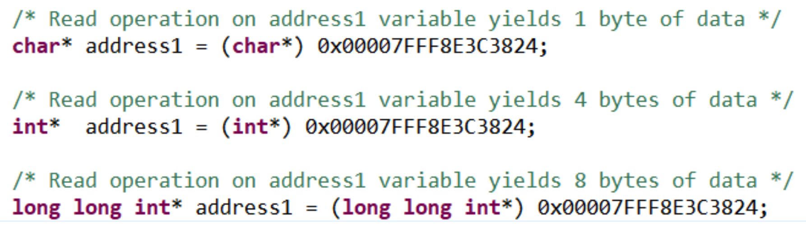
- 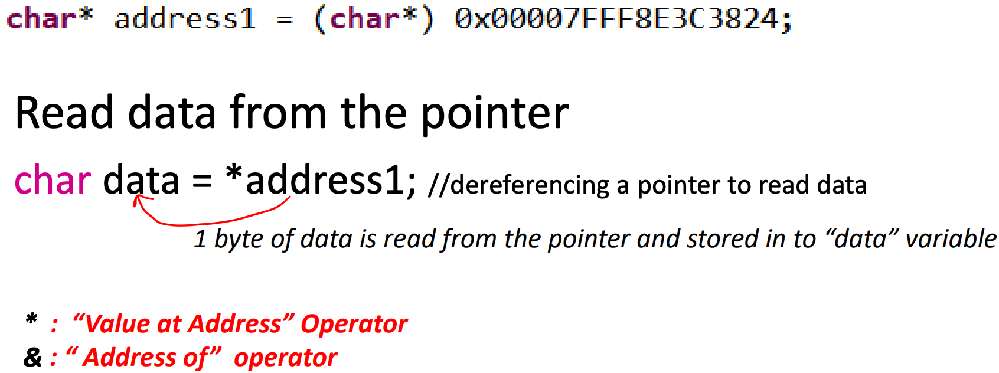
- 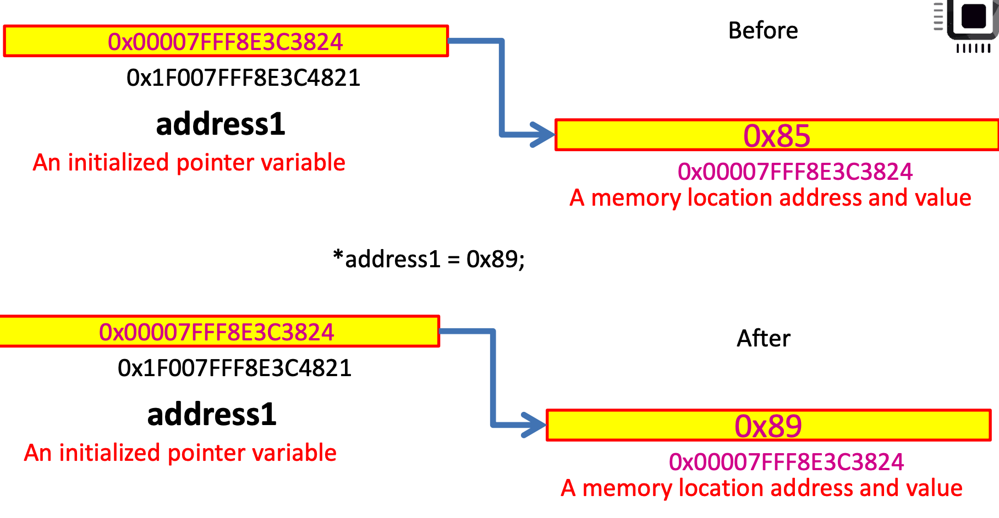
- char\* pAddress = &data; (The address of the variable data is stored in the pointer variable pAddress)
- value = \* pAddress; Dereferencing the address to read the value stored
- - pAddress = 65; Dereferencing the address to write the value 65, stored at the location of &data that was assigned earlier.
- 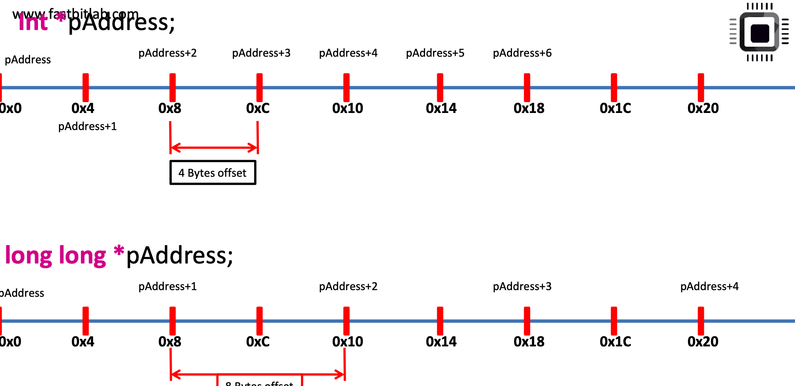

#### How are pointers used in embedded programming?

- Store Data into required SRAM locations. (Static Random Access Memory: type of volatile RAM that stores each bit using flip-flop circuits made of 4-6 transistors, retaining data as long as power is supplied without needing refresh cycles)
- For copying data from peripheral registers to SRAM memory and vice versa
- To Configure the peripheral registers. Because peripheral registers are memory-mapped and each register will be given unique address in the MCU memory map.
- Pointers to ISRs are stored in a vector table to handle the interrupts.
- Pointers are also used to configure the memory-mapped processor specific registers like interrupt configuration registers

#### Portability Issues in C

- C standard didnt define the storage size for ints.
- Its up to compiler vendors to choose the storage size for the variable depending solely on hardware capabilities of the target platform.
- In order to get rid of portability issues due to data type size mismatch across different compilers , you have to stop using standard data type names, instead use the data type alias names given by the header file **stdint.h**
  - The standard library header file stdint.h defines fixedwidth integers using alias data types for the standard data types available in ‘C’
  - A fixed-width integer data type is an aliased data type that is based on the exact number of bits required to store the data
- 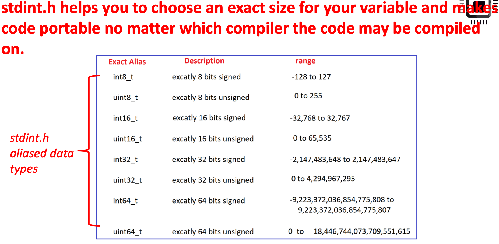
- uintmax_t : defines the largest fixed-width unsigned integer possible on the system
- intmax_t : defines the largest fixed-width signed integer possible on the system
- uintptr_t : defines a unsigned integer type that is wide enough to store the value of a pointer.

#### Bitwise Operators in C

- 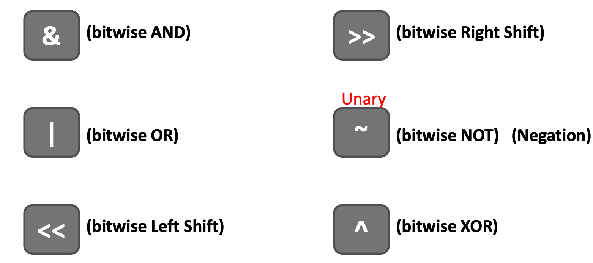
- if A = 00101000, ~A = 11010111
  - Testing of bits ( &)
  - Setting of bits (|)
  - Clearing of bits (~ and &)
  - Toggling of bits (^)
- Bit-Masking
  - **Bitmasking** is a programming technique that uses bitwise operators to selectively modify, extract, or combine individual bits within binary data structures, such as registers or memory locations.
  - At its core, bitmasking treats binary digits (0s and 1s) as flags to represent the presence or absence of specific features or states. Instead of using separate variables for multiple true-or-false values, you can store them together in a single variable by manipulating individual bits.
